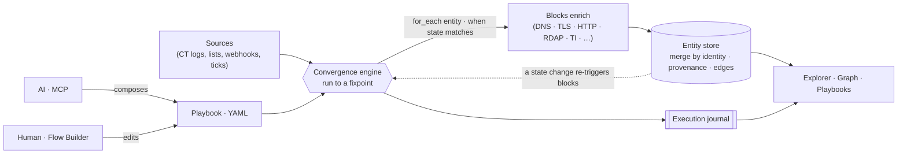

# convergence

Repeatable agentic recon. **An AI composes the dataflow; a deterministic engine
runs it to a fixpoint.** The AI never runs the conveyor belt — it only designs
the machine.

The name is the execution model: enrichment blocks re-evaluate against each
entity's current **state** and re-run until nothing changes — so a fact ("port
50 open", "resolved to this IP") triggers its reactions no matter which of a
hundred paths discovered it.



The dashed edge is the whole idea: a write to the store re-triggers every block
whose guard now matches — the loop runs until the store stops changing.

## Why

LLM agents skip steps, forget across compaction, can't sustain high throughput,
and don't persist. So we don't let them execute. They author a declarative flow
(high-level, story-like verbs); the runtime does the running — with retries,
rate limits, backpressure, dedup, and provenance handled once, for all flows.

Think **Terraform's authoring & state model + GNU Radio's streaming execution**,
for large-scale reconnaissance. Not n8n: n8n passes opaque JSON between nodes and
has no domain-entity model. Our moat is **entity resolution with provenance** —
many blocks converge into one `host` / `person` / `domain` / `webpage` /
anything, every field annotated with where it came from.

## Interfaces

- **AI → MCP**: list blocks, validate a flow, run it to convergence, query
  entities (`src/mcp`, `yarn mcp`) — all over the `@modelcontextprotocol` SDK.
- **Human → Flow Builder**: a [`qrp`](https://www.npmjs.com/package/@nemanjan00/qrp)
  frontend (`frontend/`, esbuild-bundled) over the same YAML — entity explorer,
  draggable node canvas, discovery graph, and an n8n-style **Executions** log.

**Playbooks** are saved flows with a lifecycle — `draft → active → paused`
(`src/services/playbooks`). Active playbooks are run on a schedule by the
monitor (`yarn playbooks`); they export/import as portable artifacts. Manage
them over MCP (`list/get/save/set_state/export/import_playbook`).

## Data plane

- **Flows**: YAML — declarative, diffable, versioned. See
  [`docs/FLOW_SPEC.md`](docs/FLOW_SPEC.md) (the contract).
- **Entities**: MongoDB. Schemaless documents, merged by identity, per-field
  provenance.
- **Blocks**: a push/pull service contract. See
  [`docs/BLOCK_CONTRACT.md`](docs/BLOCK_CONTRACT.md).
- **Predicates**: Mongo-style queries (via `sift`) for `when:`/`filter:` —
  declarative in YAML, identical against Mongo.

## Status

Working end-to-end on live network: the convergence engine (entity-state
fixpoint, versioned store, per-field provenance, first-class lineage edges,
typed-field auto-linking), a **YAML→flow loader** (template compilation + full
spec validation), **67 blocks + 4 sources** ([`docs/BLOCKS.md`](docs/BLOCKS.md)),
the MCP interface, the qrp frontend, an execution journal (Mongo-persistable),
optional Mongo persistence, and a cron **monitor** for watching targets over
time.

```bash
yarn install
yarn flow      # load, validate, and RUN examples/flows/ct-recon.yaml (live)
yarn export    # run a flow and serialize entities+provenance+edges+executions
yarn mcp       # AI-facing MCP server (stdio)
yarn monitor   # re-run a flow on a cron (MONITOR_CRON); accumulate + alert
yarn playbooks # run every ACTIVE playbook on a cron (play/pause runtime)
yarn test      # 272 tests
yarn lint
yarn frontend:build   # esbuild-bundle the qrp UI to a self-contained HTML
```

`yarn flow` parses the real YAML, validates it (ids, entities, for_each
producers, cycles, sift shape, template paths), compiles `{{ }}` templates, and
converges it live — e.g. `ct-recon.yaml`: CT logs → SANs fan out to hosts →
DNS/RDAP/ports/TLS/HTTP enrich each, every field provenanced, the discovery
graph recorded as edges.

**Block library** — 67 blocks across discovery (CT/passive DNS), DNS, mail,
IP/ASN/network, TLS/certs, HTTP/web (incl. a self-feeding crawler),
threat-intel, forensics, and flow control (`filter`, `regex`, `js`, `cli`,
`webhook`). Full catalog with input/output + composition scenarios in
[`docs/BLOCKS.md`](docs/BLOCKS.md).

Pending: engine **parent references** (reach a derived entity's ancestors in
`inputs`/`when`/`filter`), a served HTTP backend (re-run from the Executions
panel + inbound `source.webhook` route), and a Mongo-native store for
explorer-at-scale. See [`docs/ARCHITECTURE.md`](docs/ARCHITECTURE.md).

## Docs

- [Architecture](docs/ARCHITECTURE.md)
- [Flow spec (the contract)](docs/FLOW_SPEC.md)
- [Block contract](docs/BLOCK_CONTRACT.md)
