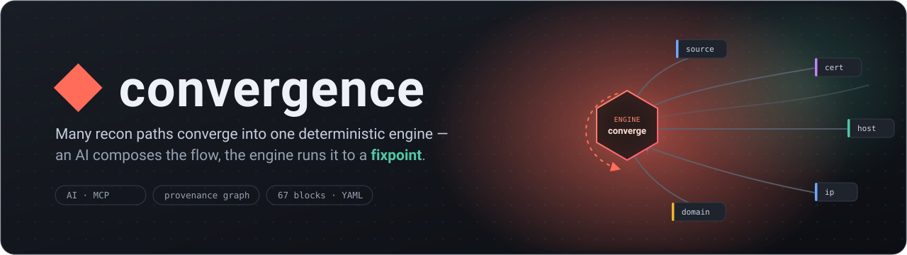
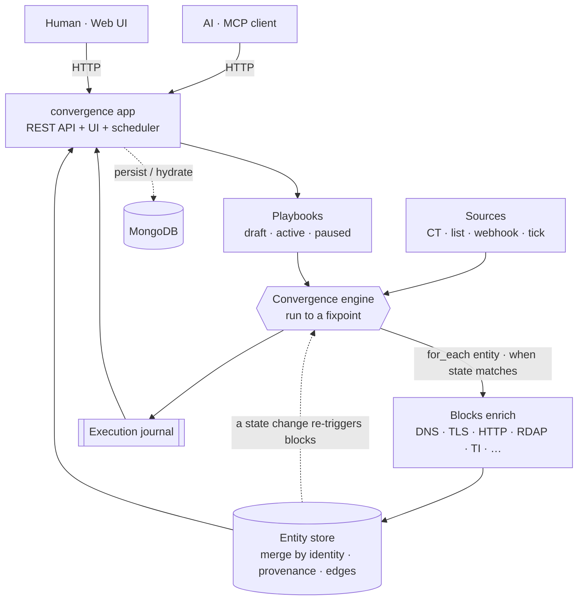
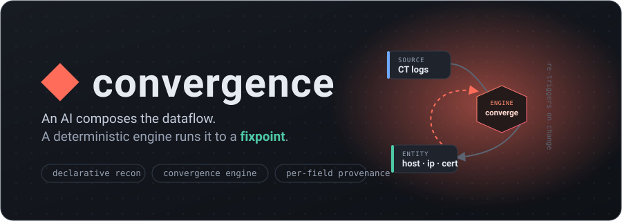

# convergence

<p align="center"></p>

> Repeatable agentic reconnaissance — **an AI composes the dataflow; a
> deterministic engine runs it to a fixpoint.** The AI designs the machine; it
> never runs the conveyor belt.


> **Project status — honest version.** This is an **alpha / reference
> implementation**, not a product. It runs end-to-end on live network with 285
> passing tests and a real served app (REST API + UI + scheduler); the UI is
> fully wired to the API (playbook lifecycle, execution re-run, imports), and the
> engine supports parent references. But: it's a **single node with an in-memory
> working set** (Mongo persists/hydrates it, but it's not a Mongo-native store
> yet); there is **no auth** on the API; and block I/O + the flow spec **may
> still change**. Use it for research and self-hosted recon, not production.
> Nothing here needs an API key. See [Status](#status) for the real-vs-pending
> breakdown.

The name is the execution model: enrichment blocks re-evaluate against each
entity's current **state** and re-run until nothing changes — so a fact ("port
50 open", "resolved to this IP") triggers its reactions no matter which of a
hundred paths discovered it.



Both surfaces talk to one running app. The dashed engine loop is the whole idea:
a write to the store re-triggers every block whose guard now matches — it runs
until the store stops changing.

## Why

LLM agents skip steps, forget across compaction, can't sustain high throughput,
and don't persist. So we don't let them execute. They author a declarative flow
(high-level, story-like verbs); the runtime does the running — with retries,
rate limits, backpressure, dedup, and provenance handled once, for all flows.

Think **Terraform's authoring & state model + GNU Radio's streaming execution**,
for large-scale reconnaissance. Not n8n: n8n passes opaque JSON between nodes and
has no domain-entity model. Our moat is **entity resolution with provenance** —
many blocks converge into one `host` / `person` / `domain` / `webpage` /
anything, every field annotated with where it came from.

## Interfaces

One long-running app (`src/index.js`, `yarn web`) owns the state and serves a
**REST API** + the **UI**; both surfaces below talk to it:

- **AI → MCP**: `bin/mcp.mjs` (`yarn mcp`) is a `@modelcontextprotocol` stdio
  server that is a **thin HTTP client of the app's API** — list blocks, validate/
  run flows, query entities, and manage playbooks. Point it with `CONVERGENCE_URL`.
- **Human → Web UI**: a [`qrp`](https://www.npmjs.com/package/@nemanjan00/qrp)
  frontend the app serves — entity explorer, draggable node canvas, discovery
  graph, an n8n-style **Executions** log, and **Playbooks** — fetching live data
  from `/api/snapshot`.

### API (selected)

```
GET  /api/health · /api/blocks · /api/snapshot · /api/executions[?failed=1]
POST /api/flows/validate · /api/flows/run · /api/entities/query · /api/webhook
GET/POST/PUT/DELETE /api/playbooks[/:id]   POST /api/playbooks/:id/{state,run}
GET  /api/playbooks/:id/export   POST /api/playbooks/import
```

**Playbooks** are saved flows with a lifecycle — `draft → active → paused`
(`src/services/playbooks`). The app's scheduler runs every *active* playbook on
`MONITOR_CRON`; they export/import as portable artifacts. Manage them over the
API or MCP (`list/get/save/set_state/export/import_playbook`).

## Run it

**Docker (one command).** Brings up MongoDB **and** the app (REST API + UI +
active-playbook scheduler), wired together — the app waits for the DB via a
healthcheck, and state persists in a named volume:

```bash
docker compose up --build          # open http://localhost:3000
docker compose run --rm app yarn flow    # one-shot: converge ct-recon (live)
docker compose exec app yarn mcp         # MCP server, talking to the app's API
```

**Local** (Node 20+, yarn):

```bash
yarn install
yarn web       # REST API + UI + scheduler -> http://localhost:3000
yarn mcp       # MCP server (CONVERGENCE_URL, defaults to localhost:3000)
```

Nothing here needs an API key. (No auth on the API yet — keep it to localhost /
a trusted network.)

## Data plane

- **Flows**: YAML — declarative, diffable, versioned. See
  [`docs/FLOW_SPEC.md`](docs/FLOW_SPEC.md) (the contract).
- **Entities**: MongoDB. Schemaless documents, merged by identity, per-field
  provenance.
- **Blocks**: a push/pull service contract. See
  [`docs/BLOCK_CONTRACT.md`](docs/BLOCK_CONTRACT.md).
- **Predicates**: Mongo-style queries (via `sift`) for `when:`/`filter:` —
  declarative in YAML, identical against Mongo.

## Status

Working end-to-end on live network: the convergence engine (entity-state
fixpoint, versioned store, per-field provenance, first-class lineage edges,
typed-field auto-linking), a **YAML→flow loader** (template compilation + full
spec validation), **67 blocks + 4 sources** ([`docs/BLOCKS.md`](docs/BLOCKS.md)),
a **served app** (REST API + UI + active-playbook scheduler), the MCP interface
(an HTTP client of that API), the qrp frontend, an execution journal, playbook
lifecycle, and Mongo persistence/hydrate.

Recently landed: the served app, the UI fully wired to the API (playbook
lifecycle, execution **re-run** / re-run-all-failed, sample + manual import), and
engine **parent references** (a derived entity reads its ancestors' fields in
`inputs`/`when`/`filter`). Pending: a Mongo-native store (query at scale) and
**auth** on the API.

```bash
yarn install
yarn web       # the served app: REST API + UI + scheduler (http://localhost:3000)
yarn flow      # one-shot: load, validate, and RUN ct-recon.yaml (live)
yarn export    # run a flow and serialize entities+provenance+edges+executions
yarn mcp       # AI-facing MCP server (stdio)
yarn monitor   # re-run a flow on a cron (MONITOR_CRON); accumulate + alert
yarn playbooks # run every ACTIVE playbook on a cron (play/pause runtime)
yarn test      # 285 tests
yarn lint
yarn frontend:build   # esbuild-bundle the qrp UI to a self-contained HTML
```

`yarn flow` parses the real YAML, validates it (ids, entities, for_each
producers, cycles, sift shape, template paths), compiles `{{ }}` templates, and
converges it live — e.g. `ct-recon.yaml`: CT logs → SANs fan out to hosts →
DNS/RDAP/ports/TLS/HTTP enrich each, every field provenanced, the discovery
graph recorded as edges.

**Block library** — 67 blocks across discovery (CT/passive DNS), DNS, mail,
IP/ASN/network, TLS/certs, HTTP/web (incl. a self-feeding crawler),
threat-intel, forensics, and flow control (`filter`, `regex`, `js`, `cli`,
`webhook`). Full catalog with input/output + composition scenarios in
[`docs/BLOCKS.md`](docs/BLOCKS.md).

Pending: a **Mongo-native store** for explorer-at-scale, and **auth** on the
served API. See [`docs/ARCHITECTURE.md`](docs/ARCHITECTURE.md).

## Docs

- [Architecture](docs/ARCHITECTURE.md)
- [Flow spec (the contract)](docs/FLOW_SPEC.md)
- [Block contract](docs/BLOCK_CONTRACT.md)
- [Block & source catalog](docs/BLOCKS.md)
- [Data model](docs/DATA_MODEL.md) · [Egress](docs/EGRESS.md)

---

<p align="center"></p>

<p align="center"><sub>◆ convergence · alpha · not affiliated with any vendor · use for authorized recon only</sub></p>
